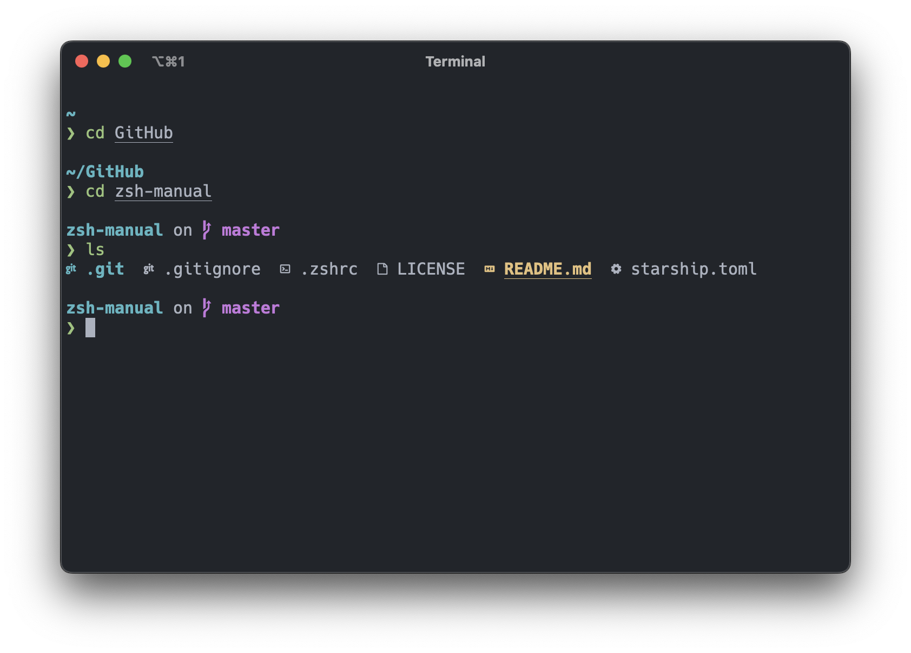

# custom-terminal

This repository contains scripts for automatic terminal configuration in unix-like systems. I like to customize the terminal the way it suits me, and if there is an opportunity to improve it even more, I will take advantage of it.

## Tools

[zsh](https://www.zsh.org) – shell designed for interactive use

[oh-my-zsh](https://ohmyz.sh) – framework for managing zsh configuration

[starship](https://www.zsh.org) – customizable prompt for any shell

[exa](https://the.exa.website) – replacement for `ls`

[bat](https://github.com/sharkdp/bat) – replacement for `cat`