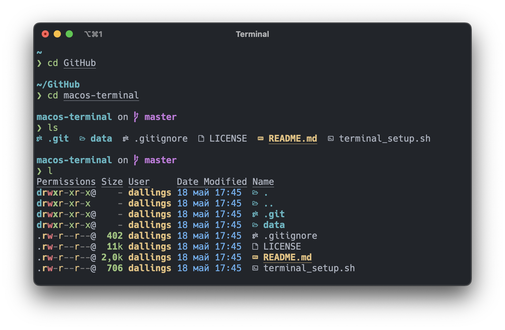

# macos-terminal

This repository contains script for automatic terminal configuration in macOS system. But, if you want take it manually, you should go to the [Manual Mode](#manual-mode) section. I like to customize the terminal the way it suits me, and if there is an opportunity to improve it even more, I will take advantage of it.



## Table of Contents
- [Tools](#tools)
- [Usage](#usage)
- [Manual Mode](#manual-mode)

## Tools

[zsh](https://www.zsh.org) – shell designed for interactive use

[oh-my-zsh](https://ohmyz.sh) – framework for managing zsh configuration

[starship](https://starship.rs) – customizable prompt for any shell

[exa](https://the.exa.website) – replacement for `ls`

[bat](https://github.com/sharkdp/bat) – replacement for `cat`

## Usage

Run script:

```
cd macos-terminal
chmod +x terminal_setup.sh
./terminal_setup.sh
```

## Manual Mode

Install homebrew:

```
/bin/ -c "$(curl -fsSL https://raw.githubusercontent.com/Homebrew/install/HEAD/install.sh)"
```

Install font:

```
brew tap homebrew/cask-fonts
brew install --cask font-hack-nerd-font
```

Install utilities:

```
brew install starship exa bat
```

Install oh-my-zsh:

```
sh -c "$(curl -fsSL https://raw.githubusercontent.com/ohmyzsh/ohmyzsh/master/tools/install.sh)"
```

Install zsh-autosuggestions plugin:

```
git clone https://github.com/zsh-users/zsh-autosuggestions ${ZSH_CUSTOM:-~/.oh-my-zsh/custom}/plugins/zsh-autosuggestions
```

Install zsh-syntax-highlighting plugin:

```
git clone https://github.com/zsh-users/zsh-syntax-highlighting ${ZSH_CUSTOM:-~/.oh-my-zsh/custom}/plugins/zsh-syntax-highlighting
```

Copy zsh config:

```
mv data/config/.zshrc ~/.zshrc
```

Copy starship config:

```
mkdir ~/.config/starship/
mv data/config/starship.toml ~/.config/starship/starship.toml
```

Install iTerm2 with homebrew ([One Dark theme](data/themes/onedark.itermcolors) for iTerm2):

```
brew install --cask iterm2
```
